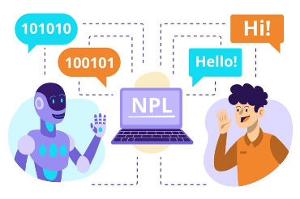

# **NLP**


Este proyecto tiene como objetivo mostrar la resolución de los desafíos evaluatorios de la materia Procesamiento de Lenguaje Natural, del Posgrado Carrera de Especialización en Inteligencia Artificial, del Laboratorio de Sistemas Embebidos, de la Facultad de Ingeniería de la Universidad de Buenos Aires, realizados durante el quinto bimestre de cursada del año 2024.

---

## **Tabla de Contenidos**
1. [Descripción](#descripción)  
2. [Desafíos](#desafíos)
3. [Características](#características)  
4. [Instalación](#instalación)  
5. [Créditos](#créditos)  
6. [Alumno](#alumno) 
7. [Contacto](#contacto)   

---

## **Descripción**
A modo de evaluar lo aprendido en la materia, se plantearon cuatro desafíos a resolver. Cada uno de ellos, permite utilizar los conocimientos adquiridos durante el desarrollo de a materia. Los temas a desarrollar, fueron los siguientes:

1. Vectorización de documentos y Entrenamiento de modelos de clasificación Naïve Bayes.
2. Vectores de Gensim y Test de Analogías.
3. Generación de Secuencias.
4. Construir un Question/Answer Bot.

---

## **Desafíos**
1. Desafío Nº1:
- Utilizando el conjunto de datos 20 Newsgroups, se realizan tareas de procesamiento de lenguaje natural, incluyendo vectorización de texto con TfidfVectorizer y CountVectorizer, cálculo de similitudes coseno entre documentos, y clasificación con modelos de Naïve Bayes (MultinomialNB y ComplementNB). Evalúa el desempeño mediante la métrica F1-score macro y optimiza parámetros de vectorización (como n-gramas, eliminación de palabras vacías y tamaño del vocabulario) y de los modelos. Además, se explora la similitud entre documentos y palabras utilizando matrices transpuestas (documento-término a término-documento) para comprender relaciones semánticas.

2. Desafío Nº2:
- Entrena modelos Word2Vec utilizando un corpus de texto, transformando oraciones en secuencias de palabras, generando vectores de palabras con los enfoques Skip-Gram y CBOW. Evalúa relaciones semánticas mediante analogías y palabras similares, y visualiza embeddings en 2D y 3D usando reducción de dimensionalidad (TSNE). También exporta los vectores generados y etiquetas para su análisis en herramientas externas. El código incluye visualizaciones interactivas de relaciones entre palabras y métricas como pérdida durante el entrenamiento.

3. Desafío Nº3:
- Esta serie de scripts implementan modelos de redes neuronales GRU, LSTM y RNN para generar texto basado en un corpus literario. Inicia procesando un archivo de texto dividiéndolo en oraciones y palabras, tokenizándolas y convirtiéndolas en secuencias numéricas. Luego, divide los datos en conjuntos de entrenamiento y validación, ajusta el tamaño del contexto para secuencias, y genera sub-secuencias con padding. Se define un modelo con capas de embedding, LSTM, y softmax para predecir palabras. Se utiliza la métrica de perplejidad en un callback personalizado para monitorear el desempeño durante el entrenamiento y aplicar *early stopping*. Finalmente, implementa una interfaz con Gradio para que el modelo genere texto de forma interactiva, agregando palabras a una frase inicial dada por el usuario.

4. Desafío Nº4:
- Implementa un modelo secuencial basado en codificador-decodificador con PyTorch para realizar generación de texto a partir de conversaciones. El flujo incluye la descarga de datos, limpieza y preprocesamiento del texto, construcción de vocabularios y conversión a secuencias de índices. Utiliza embeddings preentrenados (GloVe) para representar palabras. Define una arquitectura de red neuronal recurrente (LSTM) para el codificador y el decodificador, y entrena el modelo utilizando datos divididos en conjuntos de entrenamiento y validación. Durante el entrenamiento, monitorea las métricas de pérdida y precisión. Finalmente, permite realizar inferencias con un ajuste de aleatoriedad (temperature sampling) para generar respuestas más variadas. También incluye funciones para guardar los modelos y graficar las métricas.

---

## **Características**
- ✅ Fácil de usar.  
- 📖 Didáctico.  
- 💻​ Aprendizaje puesto en práctica.  
- 🏋🏽 Escaso costo computacional.  

---

## **Instalación**
Pasos para instalar y configurar el proyecto:  

### Requisitos Previos 
-  
- 🛜 Acceso a internet  

### Pasos
1. Clona el repositorio:  
   ```bash  
   git clone https://github.com/fabriciolopretto/NLP.git  
   cd NLP  

---

## **Créditos:**
Agradecimientos a las siguientes bibliotecas y recursos:

- Gensim
- Keras
- Matplotlib
- Numpy
- Pandas
- Plotly
- Pytorch
- Seaborn
- Sklearn
- Tensorflow

---

## **Docente:**
:octocat: Dr. Rodrigo Cardenas Szigety

---

## **Alumno:**
Fabricio Lopretto (a1616) </h1>.

---

## **Contacto:**
Para dudas o sugerencias, contacto en:
<a href="fabriciolopretto@gmail.com.ar"></a> 
<a href="https://www.linkedin.com/in/fabricio-lopretto-scientific-analyst/"></a>
